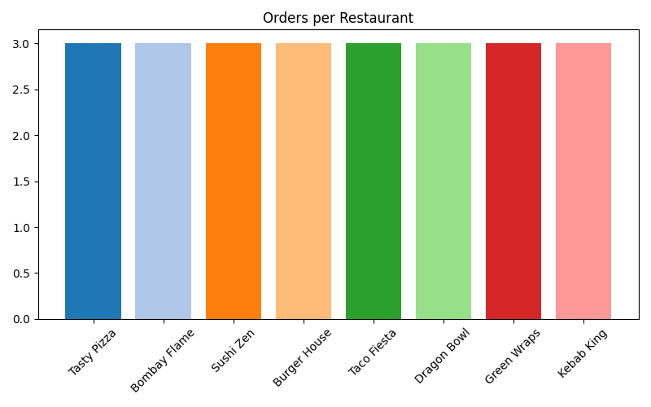
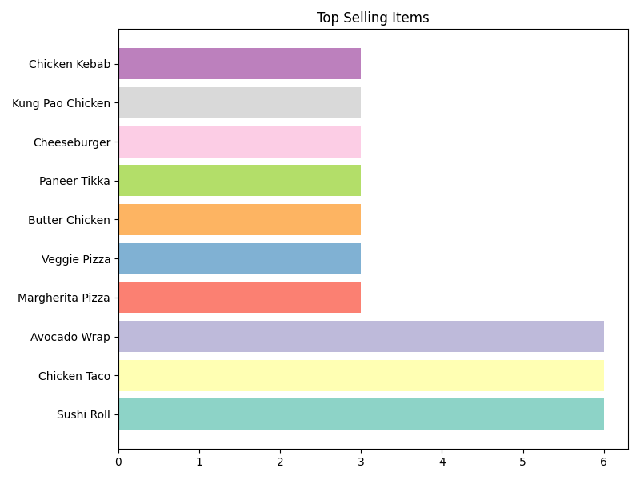
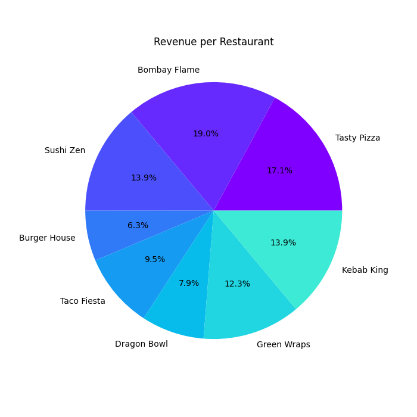
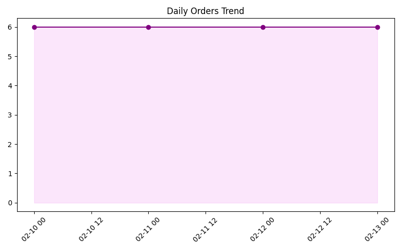
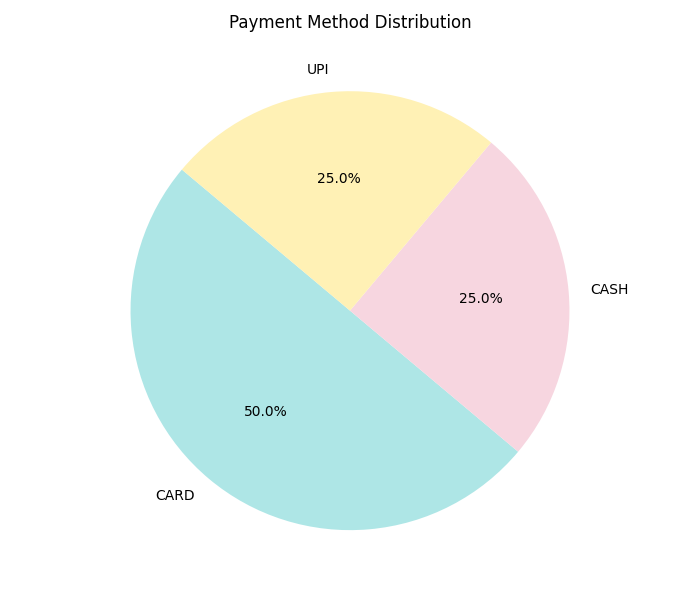
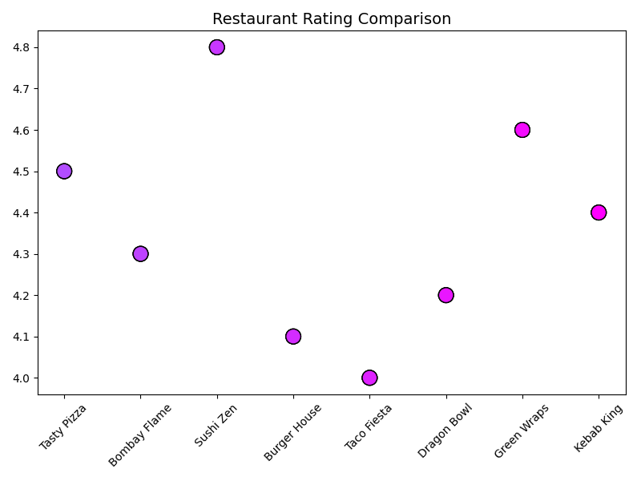

# 🍽️ Smart Food Delivery & Marketplace Management System


---

## 📌 Overview
This project presents a data-driven food delivery management system designed to simulate real-world platforms like Uber Eats or DoorDash.

The system integrates:
- Relational Database (MySQL)
- NoSQL Database (MongoDB)
- Python-based analytics for insights and visualization

---

## 🚀 Key Highlights
- Designed an end-to-end database system for food delivery operations
- Implemented MySQL schema with 3NF normalization
- Developed analytical SQL queries for business insights
- Built a Python analytics pipeline using Pandas and Matplotlib
- Implemented MongoDB NoSQL model with aggregation queries
- Generated visual dashboards for decision-making

---

## 🧱 System Architecture

### 🔹 Relational Model (MySQL)
Includes:
- Customers
- Restaurants
- Menu & Menu Items
- Orders & Order Items
- Payments
- Drivers & Deliveries
- Promotions & Reviews

Ensures:
- Data integrity
- Reduced redundancy
- Efficient querying

---

### 🔹 NoSQL Model (MongoDB)
- Collections: customers, restaurants, drivers, orders
- Embedded documents for:
  - order items
  - payment
  - delivery

Advantages:
- Flexible schema
- Reduced joins
- Faster nested queries

---

## 📊 Analytics & Visualizations

### Orders per Restaurant


### Top Selling Items


### Revenue Distribution


### Daily Orders Trend


### Payment Methods


### Ratings vs Orders


---

## 📊 Business Insights
- Identified top-performing restaurants
- Analyzed payment behavior
- Detected peak order trends
- Evaluated ratings vs performance
- Compared revenue distribution

---

## 🔄 System Workflow
1. Customer places order
2. Order linked to restaurant
3. Payment processed
4. Driver assigned
5. Delivery completed
6. Feedback recorded

---

## 📂 Project Structure

```text
smart-food-delivery-management-system/
│
├── app/
├── sql/
├── nosql/
├── diagrams/
├── charts/
├── docs/
│
├── requirements.txt
└── README.md
```

---

## ⚙️ Setup Instructions

### 1. Clone Repository
git clone https://github.com/your-username/smart-food-delivery-management-system.git

### 2. Install Requirements
pip install -r requirements.txt

### 3. Setup Database
Run:
sql/schema_and_seed.sql

### 4. Configure DB
Open:
app/db_config.py

Update:
password="your_password_here"

### 5. Run Project
python app/app.py

---

## 🔮 Future Improvements
- Web dashboard (Flask/Streamlit)
- Real-time tracking
- API integration
- ML-based predictions

---

## 👨‍💻 Author
Dev Patel

---

## ⭐ Star this repo if you like it!# smart-food-delivery-management-system
